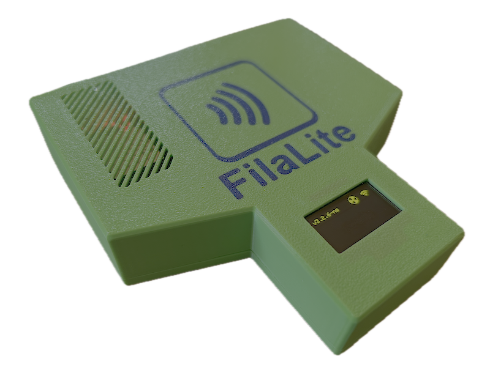
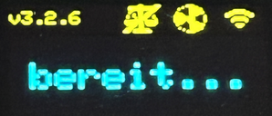

# NFC-only Modus

## Beschreibung
Es kann praktisch sein, ein kleines Gerät in der Nähe deines Desktop-Computers zu haben, wenn du neue Spulen in deine Datenbank hinzufügst.
So kannst du sofort NFC-Tags für sie schreiben. Da keine Waage erforderlich ist (das Gewicht einer neuen Spule ist in der Regel bekannt), ist es sinnvoll, auf diese Funktion zu verzichten, um einen kleineren Formfaktor zu erreichen.

## Bedienung

Bevor du das NFC-only Terminal verwenden kannst, musst du es in der `FilaMan System App` registrieren, wie bei jeder anderen Waage auch.

### Tag schreiben
Hauptzweck ist das Schreiben neuer NFC-Tags.

Du startest den Schreibvorgang in der `FilaMan System App` (Web-GUI). Dann wählst du dein NFC-Gerät aus und folgst den Anweisungen auf dem Display.

### Tag lesen
Das Gerät kann Tags zwar lesen, sinnvolle Anwendungsfälle sind jedoch ohne Waage eingeschränkt.
Du kannst trotzdem eine Spule identifizieren und ihr einen Standort mit dem entsprechenden Standort-Tag zuweisen.

Aber ehrlich gesagt: der Hauptzweck des NFC-only Gerätes ist **TAG SCHREIBEN**.

## NFC-only Modus

Beim Start versucht der ESP32, den HX711 (Verstärker) zusammen mit einem angeschlossenen Loadcell-Sensor zu erkennen. Wenn das gelingt, startet er im Normalmodus mit voller Funktionalität.

Andernfalls schaltet er in den **NFC-only Modus**!

Statt einer Gewichtsanzeige zeigt das Display eine Bereitschaftsmeldung. Zusätzlich ist das Waagensymbol in der oberen Zeile durchgestrichen.

## Aufbau / Installation
### Hardware
Die Verkabelung der Hardware ist gleich wie bei der originalen, voll ausgestatteten FilaMan-Waage. Es gibt nur 3 Unterschiede:

- Kein HX711 angeschlossen (und natürlich keine Loadcell)
- Kein Tastensensor (ohne Waage ist kein Tarieren nötig)
- optional: 10k Pull-up-Widerstand an Pin 16 (RX2)

Der Pull-up-Widerstand ist nicht zwingend erforderlich, erhöht aber die Zuverlässigkeit beim Erkennen eines fehlenden HX711. Ohne Pull-up-Widerstand sollte es aber ebenfalls funktionieren.

| Komponente    | ESP32 Pin |
| ----         | ----      |
| 10k Pull-up  | 16        |
|              | 17        |
| OLED SDA     | 21        |
| OLED SCL     | 22        |
| PN532 IRQ    | 32        |
| PN532 RESET  | 33        |
| PN532 SDA    | 21        |
| PN532 SCL    | 22        |

#### PN532
- **!! Stelle sicher, dass die DIP-Schalter des PN532 auf I2C gestellt sind**
- Verbinde `VCC` mit 5V

#### OLED
- Verbinde `VCC` mit 3,3V

#### 10k Widerstand (optional)
- Verbinde den Widerstand mit PIN 16 (wo normalerweise der DOUT des HX711 angeschlossen wäre) und 5V

### Software
Folge den Anweisungen in der [Hauptdokumentation](../README.de.md#schritt-für-schritt-installation).

Du benötigst Version 3.3.1 oder neuer für eine funktionierende Hardware-Erkennung und den NFC-only Modus.
